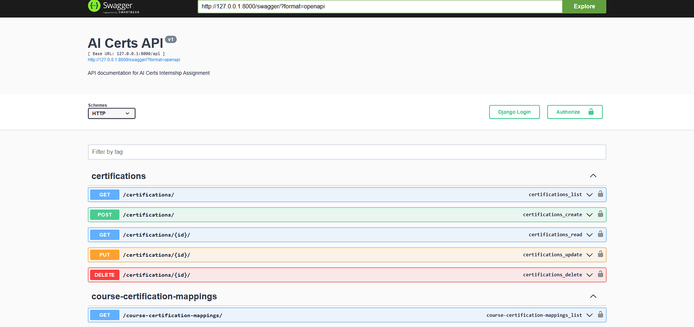
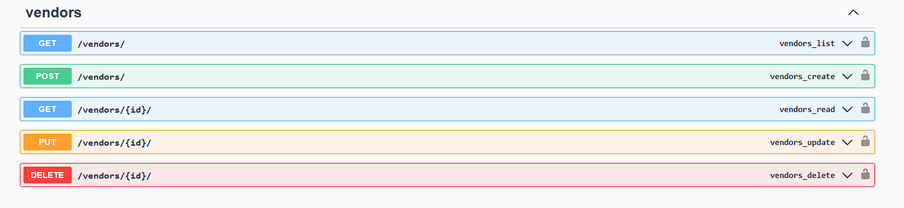
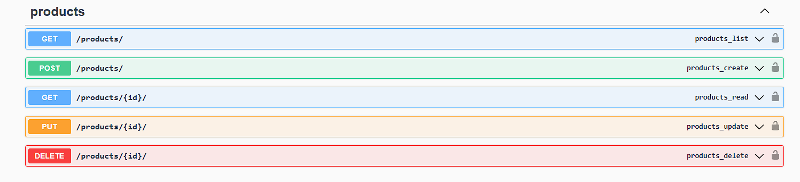
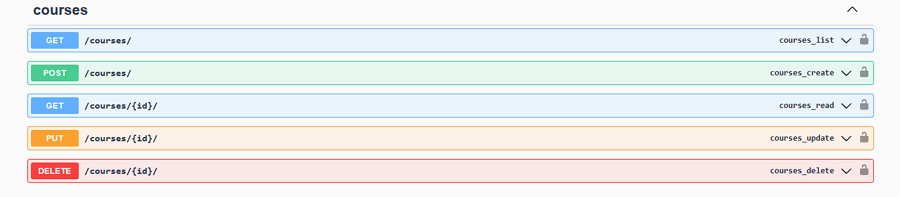
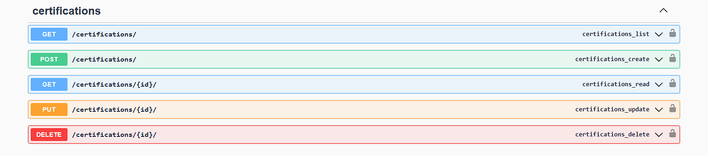
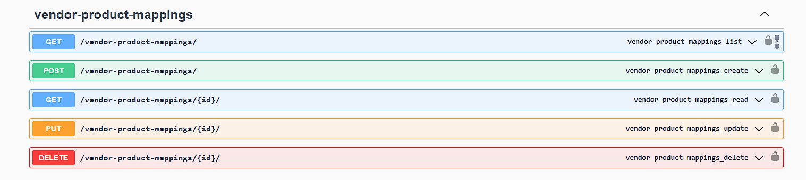

# 🚀 AI Certs Internship Assignment – Django REST API

## 📌 Project Overview

This project is a **Django REST API** developed as part of the **AI Certs Internship Assignment**.

The system manages the following entities:

* Vendors
* Products
* Courses
* Certifications

It also manages relationships between them using mapping tables:

* Vendor → Product Mapping
* Product → Course Mapping
* Course → Certification Mapping

The APIs allow full **CRUD operations** and are documented using **Swagger** for interactive testing.

---

# 🛠 Tech Stack

* Python
* Django
* Django REST Framework
* Swagger (drf-yasg)
* SQLite Database

---

# ✨ Features

✔ RESTful API design
✔ CRUD APIs for all modules
✔ Relationship mapping between entities
✔ Swagger interactive API documentation
✔ Modular Django app structure

---

# 📚 Modules Implemented

* Vendor
* Product
* Course
* Certification
* Vendor Product Mapping
* Product Course Mapping
* Course Certification Mapping

---

# 📷 Swagger API Documentation

After running the project, open Swagger documentation:

http://127.0.0.1:8000/swagger/

Swagger allows you to:

* Test APIs directly
* Send requests
* View responses
* Explore API structure

---

# 📸 Project Screenshots

## Swagger Home

## Vendors API

## Products API

## Courses API

## Certifications API

## Vendor Product Mapping

## Product Course Mapping

## Course Certification Mapping

---

# ⚙ Installation & Setup

## 1️⃣ Clone the repository

git clone https://github.com/shivpalrathod/ai-certs-api.git

---

## 2️⃣ Navigate to project folder

cd ai-certs-api

---

## 3️⃣ Install dependencies

pip install -r requirements.txt

---

## 4️⃣ Run migrations

python manage.py migrate

---

## 5️⃣ Run the server

python manage.py runserver

---

## 6️⃣ Open Swagger documentation

http://127.0.0.1:8000/swagger/

---

# 📂 Project Structure

ai_certs_project

│

├── vendor
├── product
├── course
├── certification

├── vendor_product_mapping
├── product_course_mapping
├── course_certification_mapping

├── screenshots

├── manage.py
├── requirements.txt
└── db.sqlite3

---

# 👨‍💻 Author

**Shiva Rathod**

GitHub Profile
https://github.com/shivpalrathod

---
